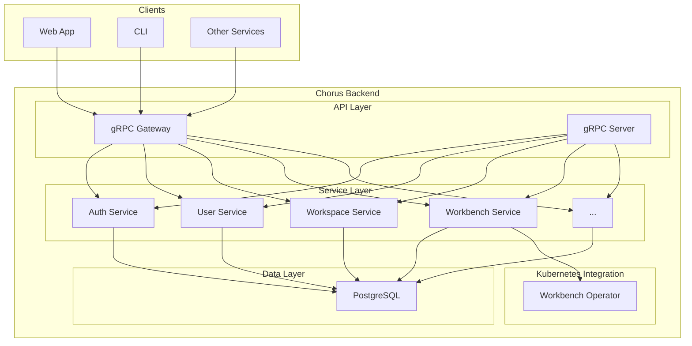

# System Patterns: Chorus Backend

## System Architecture

The Chorus Backend follows a service-oriented architecture. It is a monolithic repository (`chorus-backend`) but is structured into logical, decoupled services.

The high-level architecture consists of:
- **API Layer**: Exposes gRPC and RESTful HTTP APIs. Protocol Buffers are the source of truth for API contracts, with OpenAPI specs generated from them.
- **Service Layer**: Contains the core business logic for each domain (e.g., `User`, `Workspace`, `Workbench`).
- **Data Access Layer**: Abstracted repository pattern for database interactions, primarily with PostgreSQL.

The `README.md` file provides a detailed walkthrough for creating a new service, which is a key architectural pattern in this project.

## Key Technical Decisions

- **API First Design**: Using Protocol Buffers (`.proto` files) to define service contracts ensures consistency between gRPC and REST APIs.
- **Layered Architecture**: The separation of concerns between controllers (`internal/api/v1`), services (`pkg/.../service`), and stores (`pkg/.../store`) is a fundamental pattern.
- **Dependency Injection**: The use of providers (`internal/cmd/provider`) allows for managing dependencies and creating a modular system.
- **Middleware for Cross-Cutting Concerns**: Authentication, logging, caching, and validation are handled via middleware, keeping the service logic clean.

## Design Patterns

- **Service-Oriented**: The codebase is organized by domain into services.
- **Repository Pattern**: The `store` packages abstract data persistence details from the business logic.
- **Middleware/Interceptor Pattern**: Used extensively for both gRPC and HTTP servers to handle common request/response processing tasks.
- **Kubernetes Operator**: The `workbench-operator` is a standalone Go project within the `chorus-backend` repository. It follows the operator pattern and is built using the Kubebuilder framework. It manages `Workbench` custom resources (CRDs) to orchestrate the deployment of Xpra servers and their associated graphical applications as a cohesive unit within Kubernetes.

## Component Relationships

